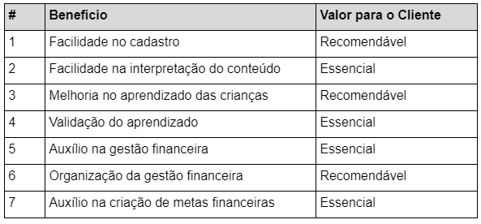

## 1. Introdução

 No contexto atual de um mundo interconectado pelo sistema capitalista e pelas redes de comunicação, a importância do dinheiro como facilitador da vida se destaca ainda mais. A gestão financeira tem se tornado uma presença cada vez mais relevante na vida da população em geral, impulsionada pela necessidade de tomar decisões conscientes orientadas por informações consistentes.

Nesse cenário, a educação financeira emerge como uma resposta essencial para orientar as escolhas financeiras, fornecendo conhecimento sobre serviços financeiros disponíveis, discernimento entre necessidades e desejos de consumo, compreensão da importância da poupança, conceitos de financiamento, juros, investimentos e rendimentos. Essa disciplina abrange a compreensão das melhores práticas para administrar gastos e alocar recursos de maneira estratégica, capacitando os indivíduos a tomar decisões conscientes em relação a produtos e serviços oferecidos, além de orientá-los em decisões de investimento e na prevenção de dificuldades financeiras.

Uma gestão prudente dos recursos não apenas contribui para um estilo de vida melhor, mas também impacta positivamente na qualidade de vida. Esse comportamento financeiramente responsável pode ser cultivado desde a infância, reconhecendo que quanto mais cedo essa prática for integrada ao cotidiano das pessoas, maiores serão os benefícios tanto para os indivíduos quanto para a sociedade em geral.

Nesse contexto, o Grupo Save Coin, comprometido com o desenvolvimento da educação financeira da população brasileira, visa colaborar para a inserção cada vez mais precoce do ensino financeiro na vida das crianças brasileiras, passando-lhes conhecimentos básicos essenciais por meio de didática simples e pequenos jogos e, a longo prazo, almeja contribuir para um futuro econômico mais próspero para o país.

## 1.1. Problema

A situação de endividamento no Brasil está em ascensão, sendo que diversos fatores contribuem para esse cenário. Entre esses fatores, podemos destacar a inexperiência no manejo do dinheiro, os impulsos consumistas e a facilidade de acesso ao crédito, que muitas vezes culminam no aumento do número de brasileiros endividados.

Atualmente, as pessoas são expostas a uma variedade de oportunidades de compra, tanto em lojas físicas quanto em plataformas de comércio eletrônico. Além disso, estratégias diversas incentivam o consumo excessivo, seja por meio de múltiplas opções de pagamento, seja pelo marketing que associa novos produtos ao status social, ou ainda pela comodidade dos sistemas de entrega (MINELLA et al., 2017).

De acordo com o IBGE (2023), a inflação acumulada entre julho de 2022 e julho de 2023 atingiu 3,99%. Esse contexto tem impactado o poder de compra das famílias, levando a um endividamento crescente na tentativa de manter padrões de vida e necessidades básicas. A pesquisa apresentada pela Agência Brasil e conduzida pela Confederação Nacional do Comércio de Bens, Serviços e Turismo (CNC) revela que 78,5%  das famílias brasileiras relataram ter dívidas a vencer, o maior índice desde janeiro de 2010, quando iniciou-se esta série (SAMPAIO, 2023).

No âmbito da educação financeira para crianças, é crucial que os pais exerçam um papel exemplar, visto que a carência desse aprendizado na infância pode acarretar uma série de obstáculos e dilemas ao longo da trajetória de vida. Sem o domínio de noções elementares de gerenciamento financeiro, os jovens podem amadurecer desprovidos das competências essenciais para efetuar escolhas conscientes acerca do dinheiro. Tal lacuna pode resultar em despesas impulsivas, acumulação excessiva de dívidas e ausência de planejamento financeiro, intensificando os níveis de estresse e ansiedade associados às questões monetárias.

Além disso, a ausência de educação financeira pode contribuir para a perpetuação de um ciclo de má administração financeira de uma geração para outra. Crianças que não têm a oportunidade de aprender sobre como lidar com o dinheiro podem reproduzir os mesmos erros financeiros de seus pais ou responsáveis, perpetuando padrões de comportamento prejudiciais. Isso não apenas afeta a segurança financeira individual, mas também pode ter implicações em nível societal, contribuindo para problemas econômicos mais amplos. Portanto, a ausência de educação financeira na infância não apenas prejudica o bem-estar financeiro individual, mas também impacta negativamente a saúde financeira da sociedade como um todo.

Diante dessa realidade, nosso projeto busca oferecer uma solução prática e acessível: uma plataforma que disponibiliza conteúdo educativo e didático, direcionado a crianças, para promover a conscientização sobre a importância da educação financeira desde cedo. Nosso objetivo é preparar as crianças de forma eficaz, permitindo que elas construam um futuro financeiro mais estável para si mesmas.

 
## 1.2. Objetivos do trabalho

## 1.2.1 Objetivo geral

O projeto em questão está fundamentado no objetivo amplo de promover a educação financeira, com foco no público infantil, disponibilizando informações de maneira didática e acessível. Neste sentido, o objetivo geral deste trabalho é  desenvolver um sistema web que apresentará uma interface intuitiva e de fácil utilização, contribuindo para que as crianças assimilem noções básicas de educação financeira de maneira simples e direta. Isso permitirá que elas adquiram conhecimentos essenciais nessa área e sejam capazes de aplicá-los no seu dia a dia.

A abordagem temática, estruturada de maneira didática, tem como propósito guiar as crianças através dos principais fundamentos da educação financeira. Essa estrutura visa auxiliar no desenvolvimento de conceitos e técnicas essenciais para a gestão eficaz dos recursos financeiros, conhecimentos estes que serão aplicados por toda a vida da criança usuária da aplicação. 

## 1.2.2 Objetivos específicos

O projeto apresentado possui os objetivos específicos de desenvolver e disponibilizar um conjunto de recursos didáticos voltados para o ensino de gestão financeira direcionado a crianças. Além disso, pretende-se aprimorar o aprendizado por meio de um questionário dinâmico, visando a consolidação dos conhecimentos adquiridos. Adicionalmente, busca-se implementar uma ferramenta destinada ao estabelecimento de metas, com o propósito de cultivar a prática de poupança e incentivar as crianças a alcançar objetivos financeiros de forma eficaz.

## 1.3. Justificativa

 
A educação financeira na infância desempenha um papel crucial no desenvolvimento de habilidades essenciais para a vida adulta. Ao introduzir conceitos financeiros desde cedo, as crianças aprendem a tomar decisões informadas sobre dinheiro, economizar, planejar e gastar de maneira responsável. Essa base sólida promove a compreensão das implicações das escolhas financeiras, ajudando a evitar armadilhas financeiras no futuro. Além disso, ao internalizar princípios como a importância de poupar e a diferença entre necessidades e desejos, as crianças estão mais bem preparadas para lidar com situações financeiras complexas ao longo da vida, contribuindo para uma maior segurança financeira e bem-estar geral.

Além de capacitar as crianças a tomarem decisões financeiras inteligentes, a educação financeira na infância também promove a responsabilidade e a autonomia. Ao aprenderem a administrar mesadas, definir objetivos de economia e entender a relação entre esforço e recompensa, as crianças desenvolvem habilidades valiosas de autodisciplina e planejamento. Essas competências não apenas impactam suas finanças pessoais, mas também se estendem para outras áreas da vida, fortalecendo a capacidade de definir metas, perseverar diante de desafios e tomar decisões ponderadas. Dessa forma, a educação financeira na infância oferece um investimento a longo prazo no crescimento pessoal e no sucesso financeiro das futuras gerações.

Diante do crescente endividamento da população no Brasil, torna-se evidente a importância de estabelecer uma relação saudável com as finanças desde a infância. Em uma sociedade onde o dinheiro desempenha um papel fundamental na busca pela realização pessoal, é crucial incutir noções financeiras desde cedo, fomentando a reflexão e transmitindo conhecimentos que capacitem as crianças a assumirem o controle de sua vida financeira de forma simples e eficaz, permitindo a priorização de seus sonhos e aspirações.

A adoção de práticas de gestão financeira desde os primeiros anos de vida pode integrar-se naturalmente à rotina das crianças, tornando-se um hábito enraizado que potencialmente melhorará a qualidade de vida no futuro. Em uma sociedade em constante evolução, caracterizada pelo fluxo intenso de informações, mudanças nas relações interpessoais e transformações nos padrões de consumo, a educação financeira é vital para equipar as crianças com conhecimentos relacionados à administração financeira, armadilhas do consumismo, tomada de decisões e muito mais (OLIVEIRA, 2017).

A motivação subjacente a este projeto é desenvolver uma solução web que proporcione educação financeira, com enfoque nas crianças como público-alvo. A plataforma será projetada com uma linguagem atraente e adaptada às crianças, buscando evitar que problemas financeiros se tornem recorrentes na população brasileira ao longo da vida adulta.
  

## 1.4. Público-Alvo

 
Considerando que atualmente temos a taxa de aproximadamente 78% das famílias brasileiras endividadas (NITAHARA, 2022), nós do Grupo Save Coin, acreditamos que ensinando educação financeira a crianças podemos impactar no futuro por meio da diminuição da taxa de inadimplentes e até mesmo prover maior prosperidade do país. Sendo assim, definimos nosso público alvo sendo crianças, do sexo feminino e masculino, com idade entre 06 a 12 anos, independente de classe social.

## 2. Estado da arte

 
Tendo em vista que o escopo do projeto é o desenvolvimento de uma aplicação web voltada para a educação financeira de crianças, é importante fazer uma breve abordagem sobre os conceitos de Experiência do Usuário, Design Centrado no Usuário, bem como do Mapa da Empatia, e sua relevância para o projeto em discussão.

Nesse contexto, a experiência do usuário (UX) desempenha um papel fundamental em sites educativos voltados para o público infantil, pois é um fator determinante para o envolvimento, aprendizado e desenvolvimento das crianças (SANTOS, 2021). Um design de UX bem pensado e adaptado às necessidades e capacidades das crianças pode criar um ambiente digital atraente, intuitivo e seguro, facilitando a navegação, interação e absorção de conteúdo educacional. Elementos visuais cativantes, navegação simplificada, feedbacks positivos e uma estrutura lógica podem aumentar o interesse das crianças, mantendo-as motivadas e proporcionando uma experiência significativa de aprendizado que pode influenciar positivamente seu desenvolvimento cognitivo e habilidades digitais desde cedo (FONTOURA, 2002).

Associa-se a isso o design centrado no usuário, que é essencial em aplicações web para crianças, pois suas necessidades únicas demandam uma abordagem adaptada. Isso cria uma experiência digital envolvente e educativa, com elementos visuais atrativos, interações lúdicas e segurança online. Ao focar nas perspectivas das crianças, essas aplicações facilitam o aprendizado e o desenvolvimento de forma protegida. Similar ao mapa da empatia, que mapeia as necessidades e emoções dos usuários (MOULIN, 2017), o design centrado no usuário considera as perspectivas e características únicas das crianças ao desenvolver a interface.

Assim, com base no mapa da empatia, o design é ajustado com elementos atrativos, interações intuitivas e conteúdo adaptado, resultando em uma aplicação financeira cativante. A combinação do design centrado no usuário, mapa da empatia e experiência do usuário cria um ambiente educativo informativo e envolvente para crianças.

Passando-se a uma abordagem específica da importância do ensino de educação financeira durante a infância, tem-se que esta desempenha um papel de extrema importância no desenvolvimento saudável das crianças, capacitando-as a tomar decisões financeiras informadas e responsáveis ao longo de suas vidas. Segundo Cássia D’Aquino, a faixa etária dos 5 aos 8 anos se destaca como o período ideal para incitar uma mentalidade de consumo consciente, uma vez que é nesse intervalo que as relações cognitivas essenciais para a vida adulta começam a ser moldadas (D’AQUINO, 2008, p. 9, apud PINTO et. al, 2020). Nesse sentido, reforça-se a educação financeira na infância para que os indivíduos quando adultos consumam de forma consciente sem se deixar levar pelos impulsos; ensina Ribeiro et. al (2009) que os indivíduos possuem mais dificuldades de gerir suas finanças quando deixam seus desejos tomarem o controle de si mesmos.

Embora os pais tenham um papel fundamental na educação financeira, a escola também desempenha um papel crucial, fornecendo noções básicas e abrangentes, sendo importante que a criança desenvolva um senso crítico diante de diversas abordagens, preparando-se para abordar temas financeiros posteriormente. Para tal, a colaboração entre instituições educacionais e pais é indispensável, porém, essa colaboração deve ser estruturada e adotar um modelo nacional padronizado. De acordo com a OCDE (2005), esse modelo deve estabelecer metas, conteúdos, estratégias e recursos, assegurando uma cobertura abrangente para todas as crianças a nível nacional. Isso garante que cada criança tenha acesso a materiais e ferramentas educacionais de alta qualidade, fomentando sua motivação e engajamento na educação financeira. Os resultados desse esforço conjunto seguem ao longo da vida adulta, com progressos e habilidades financeiras que perduram.

No processo de ensino há diversas abordagens metodológicas, entre elas se popularizou bastante atualmente a gamificação, uma metodologia ativa que visa estimular a dinamicidade do ensino e da aprendizagem, na qual define-se uma atividade a ser realizada para que se atinja um objetivo específico associando o processo didático com elementos existentes em jogos (MARIANO et. al, 2020). Deste modo, pode-se pensar no desenvolvimento de jogos ou na utilização de jogos já existentes concatenados ao processo de ensino de educação financeira, para que, de forma lúdica, os estudantes possam reforçar o que foi aprendido e até aplicar conceitos na prática.

Aplicativos de simulação financeira introduzem as crianças a conceitos como poupança, orçamento e tomada de decisões financeiras. Jogos de tabuleiro físicos e digitais são desenvolvidos para tornar o aprendizado sobre dinheiro uma experiência envolvente e socialmente interativa, como base podemos citar o jogo Banco Imobiliário Jr. da Fabricante Brinquedos Estrela, baseado em um jogo chamado Monopoly, fabricado pela primeira vez em 1935 nos Estados Unidos, pela empresa de brinquedos americana Hasbro. Apesar de ter a mesma estrutura e objetivos da versão tradicional, este modelo Jr. é diferente em dois aspectos: o número de casas é menor (apenas 50, enquanto na versão original são 80 casas) e os valores são mais básicos, para facilitar as contas a fim de que as crianças consigam ter uma interatividade melhor ainda mais novas, enquanto o tradicional é indicado para crianças acima de 8 anos, algumas versões do Banco Imobiliário Júnior são indicados para crianças a partir de 5 e 6 anos (ROSSONE, 2020). 

Os responsáveis e educadores deveriam ser estimulados a integrar aplicativos interativos de simulação financeira e jogos de tabuleiro nas jornadas de aprendizado das crianças. Ao fazer isso, eles podem ajudar as crianças a construir uma base sólida de alfabetização financeira e melhorar suas habilidades de tomada de decisões financeiras.

A educação financeira por meio de jogos e aplicativos interativos tem o potencial de impactar positivamente a vida das crianças. Ao incutir a conscientização financeira desde cedo, as crianças podem desenvolver hábitos financeiros saudáveis e tomar decisões informadas que as beneficiarão por toda a vida.

## 3. DOCUMENTO DE ESPECIFICAÇÃO DE REQUISITOS DE SOFTWARE
## 3.1. Objetivos deste documento

 
O projeto proposto é estruturado sobre o objetivo geral de proporcionar acesso à educação financeira, por meio de informações didáticas e acessíveis, de forma simples e objetiva, hospedado em uma Aplicação Web, baseada em uma interface intuitiva e de fácil acesso, colaborando para a absorção do conhecimento das noções básicas de educação financeira, possibilitando o aprendizado desta importante área de conhecimento e sua aplicação no cotidiano.

Ademais, este documento visa trazer as motivações, objetivos, problemas e especificações gerais e técnicas do projeto descrito acima. 

## 3.2. Escopo do produto

## 3.2.1. Save coin - Gestão financeira

 
O produto será denominado Save Coin - Gestão financeira infantil e será destinado a  proporcionar uma compreensão sólida da gestão financeira desde a infância. Ele terá um componente com aulas/artigos sobre a gestão financeira, um quiz interativo sobre os assuntos abordados e um painel interativo sobre metas financeiras e a sua gestão, todas as funcionalidades são projetadas de forma a serem acessíveis e compreensíveis para o público-alvo infantil.

## 3.2.2. Missão do produto

 
Ampliar o entendimento sobre a gestão financeira na infância de forma simplificada, educativa e didática.

## 3.2.3. Limites do produto

 
Ampliar o entendimento sobre a gestão financeira na infância de forma simplificada, educativa e didática.

## 3.2.4. Benefícios do produto

## Referências Bibliográficas

BRASIL. **Lei nº 9.610, de 19 de fevereiro de 1998**. Altera, atualiza e consolida a legislação sobre direitos autorais e dá outras providências. Brasília, DF: Presidência da República, [2022]. Disponível em: https://www.planalto.gov.br/ccivil_03/leis/l9610.htm. Acesso em: 07 set. 2021.

BRASIL. **Lei nº 13.709, de 14 de agosto de 2018**. Lei Geral de Proteção de Dados Pessoais (LGPD). Brasília, DF: Presidência da República, [2022]. Disponível em: https://www.planalto.gov.br/ccivil_03/_ato2019-2022/2020/lei/l14020.htm. Acesso em: 07 set. 2021.

CORSINI, Iuri; ARAÚJO, Thayana. **Número de inadimplentes no Brasil atinge recorde da série histórica, aponta Serasa**: São 66,6 milhões de nomes negativados em todo o país, um aumento de 4 milhões de inadimplentes em relação ao mesmo período do ano passado. In: CNN Brasil. 11 jul. 2022. Disponível em: https://cnnbrasil.com.br/business/numero-de-inadimplentes-no-brasil-atinge-recorde-da-serie-historica-aponta-serasa/. Acesso em: 31 ago. 2022. 

ENEF. **Conceito de Educação Financeira no Brasil**. In: Estratégia Nacional de Educação Financeira. Disponível em: https://www.vidaedinheiro.gov.br/educacao-financeira-no-brasil/. Acesso em: 1 set. 2022. 

IBGE – INSTITUTO BRASILEIRO DE GEOGRAFIA E ESTATÍSTICA. **IPCA 2021 – 2022**. Disponível: https://www.ibge.gov.br/explica/inflacao.php. Rio de Janeiro: IBGE, 2022. Acesso em: 31 ago. 2022.

MINELLA, João Marcos et al. **A influência do materialismo, educação financeira e valor atribuído ao dinheiro na propensão ao endividamento de jovens**. Gestão & Planejamento-G&P, v. 18, 2017. 

NITAHARA, Akemi. **Percentual de famílias com dívidas a vencer atinge recorde de 78%**: Alta nas duas faixas de renda ocorre depois de dois meses de queda. In: Agência Brasil. 8 ago. 2022. Disponível em: https://agenciabrasil.ebc.com.br/economia/noticia/2022-08/percentual-de-familias-com-dividas-vencer-atinge-recorde-de-78. Acesso em: 31 ago. 2022. 

OLIVEIRA, Anaelize dos Anjos. **O Educação financeira nos anos iniciais do ensino fundamental**: como tem ocorrido na sala de aula?. 2017. Dissertação (Mestrado Educação Matemática e Tecnológica) - Universidade Federal de Pernambuco, Recife, 2017.

PODER 360. **62 milhões de brasileiros estão inadimplentes, diz pesquisa**: Número de consumidores com contas atrasadas cresceu 6,5% em relação a junho de 2021, segundo o SPC. In: Poder 360. 22 jul. 2022. Disponível em: https://www.poder360.com.br/brasil/62-milhoes-de-brasileiros-estao-inadimplentes-diz-pesquisa/. Acesso em: 31 ago. 2022.

REIS, Tiago. **Educação financeira: 5 dicas fáceis para melhorar suas finanças**. SUNO. Disponível em: https://www.suno.com.br/guias/educacao-financeira/. Acesso em: 1 set. 2022. 

SPC Brasil. **Inadimplência Nacional de Pessoas Físicas**. Disponível em: https://static.poder360.com.br/2022/07/Ana%CC%81lise-Inadimple%CC%82ncia-BRASIL-PF_jun2022.pdf. Acesso em: 1 set. 2022. 

### Anexo | Estado da Arte

**Tema:** Educação e gestão financeira. 

 
O público alvo do presente projeto são crianças e adolescentes, do sexo feminino e masculino, com idade entre 12 a 18 anos, independente de classe social e que possuam ou não renda. 

 
Considerando que atualmente temos a taxa de aproximadamente 78% das famílias brasileiras endividadas (NITAHARA, 2022), nós do Grupo Save Coin, acreditamos que ensinando educação financeira a crianças e adolescentes, de 12 a 18 anos, pode impactar no futuro por meio da diminuição da taxa de inadimplentes e até mesmo prover maior prosperidade do país.   

## Referências Bibliográficas

 
BRASIL. **Lei nº 9.610, de 19 de fevereiro de 1998**. Altera, atualiza e consolida a legislação sobre direitos autorais e dá outras providências. Brasília, DF: Presidência da República, [2022]. Disponível em: https://www.planalto.gov.br/ccivil_03/leis/l9610.htm. Acesso em: 07 set. 2021.

 

 
BRASIL. **Lei nº 13.709, de 14 de agosto de 2018**. Lei Geral de Proteção de Dados Pessoais (LGPD). Brasília, DF: Presidência da República, [2022]. Disponível em: https://www.planalto.gov.br/ccivil_03/_ato2019-2022/2020/lei/l14020.htm. Acesso em: 07 set. 2021.

 

 
CORSINI, Iuri; ARAÚJO, Thayana. **Número de inadimplentes no Brasil atinge recorde da série histórica, aponta Serasa**: São 66,6 milhões de nomes negativados em todo o país, um aumento de 4 milhões de inadimplentes em relação ao mesmo período do ano passado. In: CNN Brasil. 11 jul. 2022. Disponível em: https://cnnbrasil.com.br/business/numero-de-inadimplentes-no-brasil-atinge-recorde-da-serie-historica-aponta-serasa/. Acesso em: 31 ago. 2022. 

 

 
ENEF. **Conceito de Educação Financeira no Brasil**. In: Estratégia Nacional de Educação Financeira. Disponível em: https://www.vidaedinheiro.gov.br/educacao-financeira-no-brasil/. Acesso em: 1 set. 2022. 

 

 
IBGE – INSTITUTO BRASILEIRO DE GEOGRAFIA E ESTATÍSTICA. **IPCA 2021 – 2022**. Disponível: https://www.ibge.gov.br/explica/inflacao.php. Rio de Janeiro: IBGE, 2022. Acesso em: 31 ago. 2022.

 

 
MINELLA, João Marcos et al. **A influência do materialismo, educação financeira e valor atribuído ao dinheiro na propensão ao endividamento de jovens**. Gestão & Planejamento-G&P, v. 18, 2017. 

 

 
NITAHARA, Akemi. **Percentual de famílias com dívidas a vencer atinge recorde de 78%**: Alta nas duas faixas de renda ocorre depois de dois meses de queda. In: Agência Brasil. 8 ago. 2022. Disponível em: https://agenciabrasil.ebc.com.br/economia/noticia/2022-08/percentual-de-familias-com-dividas-vencer-atinge-recorde-de-78. Acesso em: 31 ago. 2022. 

 

 
OLIVEIRA, Anaelize dos Anjos. **O Educação financeira nos anos iniciais do ensino fundamental**: como tem ocorrido na sala de aula?. 2017. Dissertação (Mestrado Educação Matemática e Tecnológica) - Universidade Federal de Pernambuco, Recife, 2017.

 

 
PODER 360. **62 milhões de brasileiros estão inadimplentes, diz pesquisa**: Número de consumidores com contas atrasadas cresceu 6,5% em relação a junho de 2021, segundo o SPC. In: Poder 360. 22 jul. 2022. Disponível em: https://www.poder360.com.br/brasil/62-milhoes-de-brasileiros-estao-inadimplentes-diz-pesquisa/. Acesso em: 31 ago. 2022.

 

 
REIS, Tiago. **Educação financeira: 5 dicas fáceis para melhorar suas finanças**. SUNO. Disponível em: https://www.suno.com.br/guias/educacao-financeira/. Acesso em: 1 set. 2022. 

 

 
SPC Brasil. **Inadimplência Nacional de Pessoas Físicas**. Disponível em: https://static.poder360.com.br/2022/07/Ana%CC%81lise-Inadimple%CC%82ncia-BRASIL-PF_jun2022.pdf. Acesso em: 1 set. 2022. 

 

## Anexo I | Estado da Arte

https://www.fecap.br/

https://www.ev.org.br/

https://www.sebrae.com.br/

https://edu.b3.com.br/

http://portal.mec.gov.br/

https://www.mobills.com.br/

https://www.contasonline.com.br/

https://organizze.com.br/

https://www.yupee.com.br/

## Anexo II | Metodologia de Pesquisa

**Tema:** Educação e gestão financeira. 

1. Pergunta: As pessoas sabem gerir suas finanças? 
2. Resposta: O Brasil apresenta altos índices de inadimplentes. 

**Problema de Pesquisa:** Desconhecimento das boas práticas de gestão financeira. 
1. Pergunta: Como construir uma cultura de gastos consciente?  
2. Resposta: Por meio do ensino da educação financeira para os jovens. 

2. Resposta: Por meio do ensino da educação financeira para os jovens.
 
**Objetivo:** Ensinar educação financeira para jovens. 

**Metodologia de pesquisa:** Coleta e análise de dados. 
1. Abordagem: Quali-quantitativas; 
2. Natureza: Aplicada; 
3. Objetivo: Exploratório. 

**Método:** Dedutivo. 

**Procedimentos técnicos da pesquisa:** Repositórios de trabalhos acadêmicos e portais institucionais de informações financeiras. 

**Critérios de inclusão:** 
1. Estudos relacionados à gestão financeira dos jovens e situação econômica desta classe; 
2. Realizado nos últimos 5 anos; 
3. Disponíveis na íntegra e gratuitos; 
4. Portais institucionais ou de notória credibilidade. 

**Critérios de exclusão:**
1. Publicações que não se alinham ao contexto do estudo; 
2. Matérias que apresentem cunho pessoal.
