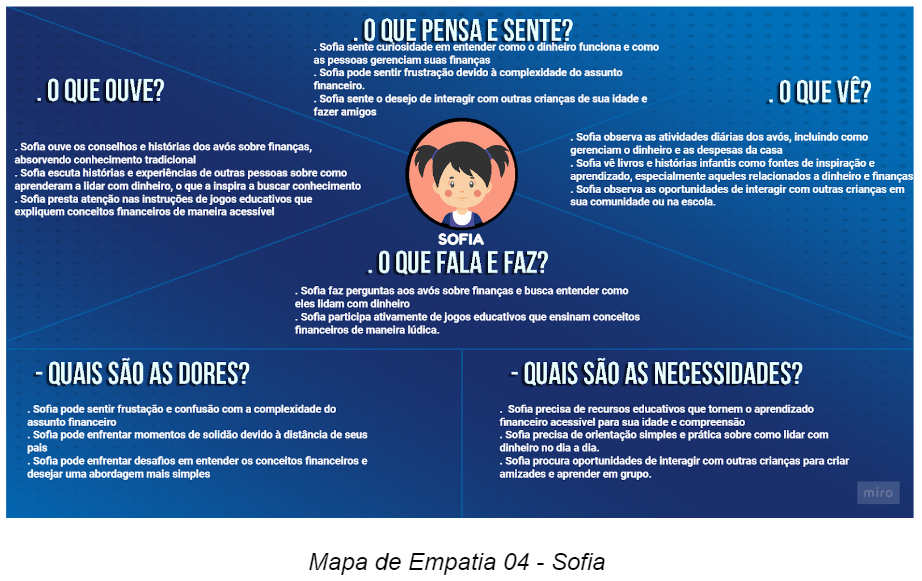
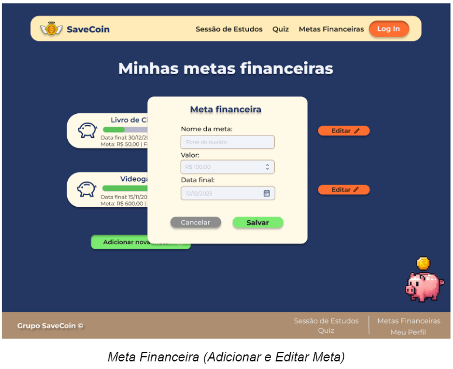

## 1. Introdução

 No contexto atual de um mundo interconectado pelo sistema capitalista e pelas redes de comunicação, a importância do dinheiro como facilitador da vida se destaca ainda mais. A gestão financeira tem se tornado uma presença cada vez mais relevante na vida da população em geral, impulsionada pela necessidade de tomar decisões conscientes orientadas por informações consistentes.

Nesse cenário, a educação financeira emerge como uma resposta essencial para orientar as escolhas financeiras, fornecendo conhecimento sobre serviços financeiros disponíveis, discernimento entre necessidades e desejos de consumo, compreensão da importância da poupança, conceitos de financiamento, juros, investimentos e rendimentos. Essa disciplina abrange a compreensão das melhores práticas para administrar gastos e alocar recursos de maneira estratégica, capacitando os indivíduos a tomar decisões conscientes em relação a produtos e serviços oferecidos, além de orientá-los em decisões de investimento e na prevenção de dificuldades financeiras.

Uma gestão prudente dos recursos não apenas contribui para um estilo de vida melhor, mas também impacta positivamente na qualidade de vida. Esse comportamento financeiramente responsável pode ser cultivado desde a infância, reconhecendo que quanto mais cedo essa prática for integrada ao cotidiano das pessoas, maiores serão os benefícios tanto para os indivíduos quanto para a sociedade em geral.

Nesse contexto, o Grupo Save Coin, comprometido com o desenvolvimento da educação financeira da população brasileira, visa colaborar para a inserção cada vez mais precoce do ensino financeiro na vida das crianças brasileiras, passando-lhes conhecimentos básicos essenciais por meio de didática simples e pequenos jogos e, a longo prazo, almeja contribuir para um futuro econômico mais próspero para o país.

## 1.1 Problema

A situação de endividamento no Brasil está em ascensão, sendo que diversos fatores contribuem para esse cenário. Entre esses fatores, podemos destacar a inexperiência no manejo do dinheiro, os impulsos consumistas e a facilidade de acesso ao crédito, que muitas vezes culminam no aumento do número de brasileiros endividados.

Atualmente, as pessoas são expostas a uma variedade de oportunidades de compra, tanto em lojas físicas quanto em plataformas de comércio eletrônico. Além disso, estratégias diversas incentivam o consumo excessivo, seja por meio de múltiplas opções de pagamento, seja pelo marketing que associa novos produtos ao status social, ou ainda pela comodidade dos sistemas de entrega (MINELLA et al., 2017).

De acordo com o IBGE (2023), a inflação acumulada entre julho de 2022 e julho de 2023 atingiu 3,99%. Esse contexto tem impactado o poder de compra das famílias, levando a um endividamento crescente na tentativa de manter padrões de vida e necessidades básicas. A pesquisa apresentada pela Agência Brasil e conduzida pela Confederação Nacional do Comércio de Bens, Serviços e Turismo (CNC) revela que 78,5%  das famílias brasileiras relataram ter dívidas a vencer, o maior índice desde janeiro de 2010, quando iniciou-se esta série (SAMPAIO, 2023).

No âmbito da educação financeira para crianças, é crucial que os pais exerçam um papel exemplar, visto que a carência desse aprendizado na infância pode acarretar uma série de obstáculos e dilemas ao longo da trajetória de vida. Sem o domínio de noções elementares de gerenciamento financeiro, os jovens podem amadurecer desprovidos das competências essenciais para efetuar escolhas conscientes acerca do dinheiro. Tal lacuna pode resultar em despesas impulsivas, acumulação excessiva de dívidas e ausência de planejamento financeiro, intensificando os níveis de estresse e ansiedade associados às questões monetárias.

Além disso, a ausência de educação financeira pode contribuir para a perpetuação de um ciclo de má administração financeira de uma geração para outra. Crianças que não têm a oportunidade de aprender sobre como lidar com o dinheiro podem reproduzir os mesmos erros financeiros de seus pais ou responsáveis, perpetuando padrões de comportamento prejudiciais. Isso não apenas afeta a segurança financeira individual, mas também pode ter implicações em nível societal, contribuindo para problemas econômicos mais amplos. Portanto, a ausência de educação financeira na infância não apenas prejudica o bem-estar financeiro individual, mas também impacta negativamente a saúde financeira da sociedade como um todo.

Diante dessa realidade, nosso projeto busca oferecer uma solução prática e acessível: uma plataforma que disponibiliza conteúdo educativo e didático, direcionado a crianças, para promover a conscientização sobre a importância da educação financeira desde cedo. Nosso objetivo é preparar as crianças de forma eficaz, permitindo que elas construam um futuro financeiro mais estável para si mesmas.

 
## 1.2 Objetivos do trabalho

## 1.2.1 Objetivo geral

O projeto em questão está fundamentado no objetivo amplo de promover a educação financeira, com foco no público infantil, disponibilizando informações de maneira didática e acessível. Neste sentido, o objetivo geral deste trabalho é  desenvolver um sistema web que apresentará uma interface intuitiva e de fácil utilização, contribuindo para que as crianças assimilem noções básicas de educação financeira de maneira simples e direta. Isso permitirá que elas adquiram conhecimentos essenciais nessa área e sejam capazes de aplicá-los no seu dia a dia.

A abordagem temática, estruturada de maneira didática, tem como propósito guiar as crianças através dos principais fundamentos da educação financeira. Essa estrutura visa auxiliar no desenvolvimento de conceitos e técnicas essenciais para a gestão eficaz dos recursos financeiros, conhecimentos estes que serão aplicados por toda a vida da criança usuária da aplicação. 

## 1.2.2 Objetivos específicos

O projeto apresentado possui os objetivos específicos de desenvolver e disponibilizar um conjunto de recursos didáticos voltados para o ensino de gestão financeira direcionado a crianças. Além disso, pretende-se aprimorar o aprendizado por meio de um questionário dinâmico, visando a consolidação dos conhecimentos adquiridos. Adicionalmente, busca-se implementar uma ferramenta destinada ao estabelecimento de metas, com o propósito de cultivar a prática de poupança e incentivar as crianças a alcançar objetivos financeiros de forma eficaz.

## 1.3 Justificativa

 
A educação financeira na infância desempenha um papel crucial no desenvolvimento de habilidades essenciais para a vida adulta. Ao introduzir conceitos financeiros desde cedo, as crianças aprendem a tomar decisões informadas sobre dinheiro, economizar, planejar e gastar de maneira responsável. Essa base sólida promove a compreensão das implicações das escolhas financeiras, ajudando a evitar armadilhas financeiras no futuro. Além disso, ao internalizar princípios como a importância de poupar e a diferença entre necessidades e desejos, as crianças estão mais bem preparadas para lidar com situações financeiras complexas ao longo da vida, contribuindo para uma maior segurança financeira e bem-estar geral.

Além de capacitar as crianças a tomarem decisões financeiras inteligentes, a educação financeira na infância também promove a responsabilidade e a autonomia. Ao aprenderem a administrar mesadas, definir objetivos de economia e entender a relação entre esforço e recompensa, as crianças desenvolvem habilidades valiosas de autodisciplina e planejamento. Essas competências não apenas impactam suas finanças pessoais, mas também se estendem para outras áreas da vida, fortalecendo a capacidade de definir metas, perseverar diante de desafios e tomar decisões ponderadas. Dessa forma, a educação financeira na infância oferece um investimento a longo prazo no crescimento pessoal e no sucesso financeiro das futuras gerações.

Diante do crescente endividamento da população no Brasil, torna-se evidente a importância de estabelecer uma relação saudável com as finanças desde a infância. Em uma sociedade onde o dinheiro desempenha um papel fundamental na busca pela realização pessoal, é crucial incutir noções financeiras desde cedo, fomentando a reflexão e transmitindo conhecimentos que capacitem as crianças a assumirem o controle de sua vida financeira de forma simples e eficaz, permitindo a priorização de seus sonhos e aspirações.

A adoção de práticas de gestão financeira desde os primeiros anos de vida pode integrar-se naturalmente à rotina das crianças, tornando-se um hábito enraizado que potencialmente melhorará a qualidade de vida no futuro. Em uma sociedade em constante evolução, caracterizada pelo fluxo intenso de informações, mudanças nas relações interpessoais e transformações nos padrões de consumo, a educação financeira é vital para equipar as crianças com conhecimentos relacionados à administração financeira, armadilhas do consumismo, tomada de decisões e muito mais (OLIVEIRA, 2017).

A motivação subjacente a este projeto é desenvolver uma solução web que proporcione educação financeira, com enfoque nas crianças como público-alvo. A plataforma será projetada com uma linguagem atraente e adaptada às crianças, buscando evitar que problemas financeiros se tornem recorrentes na população brasileira ao longo da vida adulta.
  

## 1.4 Público-Alvo

 
Considerando que atualmente temos a taxa de aproximadamente 78% das famílias brasileiras endividadas (NITAHARA, 2022), nós do Grupo Save Coin, acreditamos que ensinando educação financeira a crianças podemos impactar no futuro por meio da diminuição da taxa de inadimplentes e até mesmo prover maior prosperidade do país. Sendo assim, definimos nosso público alvo sendo crianças, do sexo feminino e masculino, com idade entre 06 a 12 anos, independente de classe social.

## 2. Estado da arte

 
Tendo em vista que o escopo do projeto é o desenvolvimento de uma aplicação web voltada para a educação financeira de crianças, é importante fazer uma breve abordagem sobre os conceitos de Experiência do Usuário, Design Centrado no Usuário, bem como do Mapa da Empatia, e sua relevância para o projeto em discussão.

Nesse contexto, a experiência do usuário (UX) desempenha um papel fundamental em sites educativos voltados para o público infantil, pois é um fator determinante para o envolvimento, aprendizado e desenvolvimento das crianças (SANTOS, 2021). Um design de UX bem pensado e adaptado às necessidades e capacidades das crianças pode criar um ambiente digital atraente, intuitivo e seguro, facilitando a navegação, interação e absorção de conteúdo educacional. Elementos visuais cativantes, navegação simplificada, feedbacks positivos e uma estrutura lógica podem aumentar o interesse das crianças, mantendo-as motivadas e proporcionando uma experiência significativa de aprendizado que pode influenciar positivamente seu desenvolvimento cognitivo e habilidades digitais desde cedo (FONTOURA, 2002).

Associa-se a isso o design centrado no usuário, que é essencial em aplicações web para crianças, pois suas necessidades únicas demandam uma abordagem adaptada. Isso cria uma experiência digital envolvente e educativa, com elementos visuais atrativos, interações lúdicas e segurança online. Ao focar nas perspectivas das crianças, essas aplicações facilitam o aprendizado e o desenvolvimento de forma protegida. Similar ao mapa da empatia, que mapeia as necessidades e emoções dos usuários (MOULIN, 2017), o design centrado no usuário considera as perspectivas e características únicas das crianças ao desenvolver a interface.

Assim, com base no mapa da empatia, o design é ajustado com elementos atrativos, interações intuitivas e conteúdo adaptado, resultando em uma aplicação financeira cativante. A combinação do design centrado no usuário, mapa da empatia e experiência do usuário cria um ambiente educativo informativo e envolvente para crianças.

Passando-se a uma abordagem específica da importância do ensino de educação financeira durante a infância, tem-se que esta desempenha um papel de extrema importância no desenvolvimento saudável das crianças, capacitando-as a tomar decisões financeiras informadas e responsáveis ao longo de suas vidas. Segundo Cássia D’Aquino, a faixa etária dos 5 aos 8 anos se destaca como o período ideal para incitar uma mentalidade de consumo consciente, uma vez que é nesse intervalo que as relações cognitivas essenciais para a vida adulta começam a ser moldadas (D’AQUINO, 2008, p. 9, apud PINTO et. al, 2020). Nesse sentido, reforça-se a educação financeira na infância para que os indivíduos quando adultos consumam de forma consciente sem se deixar levar pelos impulsos; ensina Ribeiro et. al (2009) que os indivíduos possuem mais dificuldades de gerir suas finanças quando deixam seus desejos tomarem o controle de si mesmos.

Embora os pais tenham um papel fundamental na educação financeira, a escola também desempenha um papel crucial, fornecendo noções básicas e abrangentes, sendo importante que a criança desenvolva um senso crítico diante de diversas abordagens, preparando-se para abordar temas financeiros posteriormente. Para tal, a colaboração entre instituições educacionais e pais é indispensável, porém, essa colaboração deve ser estruturada e adotar um modelo nacional padronizado. De acordo com a OCDE (2005), esse modelo deve estabelecer metas, conteúdos, estratégias e recursos, assegurando uma cobertura abrangente para todas as crianças a nível nacional. Isso garante que cada criança tenha acesso a materiais e ferramentas educacionais de alta qualidade, fomentando sua motivação e engajamento na educação financeira. Os resultados desse esforço conjunto seguem ao longo da vida adulta, com progressos e habilidades financeiras que perduram.

No processo de ensino há diversas abordagens metodológicas, entre elas se popularizou bastante atualmente a gamificação, uma metodologia ativa que visa estimular a dinamicidade do ensino e da aprendizagem, na qual define-se uma atividade a ser realizada para que se atinja um objetivo específico associando o processo didático com elementos existentes em jogos (MARIANO et. al, 2020). Deste modo, pode-se pensar no desenvolvimento de jogos ou na utilização de jogos já existentes concatenados ao processo de ensino de educação financeira, para que, de forma lúdica, os estudantes possam reforçar o que foi aprendido e até aplicar conceitos na prática.

Aplicativos de simulação financeira introduzem as crianças a conceitos como poupança, orçamento e tomada de decisões financeiras. Jogos de tabuleiro físicos e digitais são desenvolvidos para tornar o aprendizado sobre dinheiro uma experiência envolvente e socialmente interativa, como base podemos citar o jogo Banco Imobiliário Jr. da Fabricante Brinquedos Estrela, baseado em um jogo chamado Monopoly, fabricado pela primeira vez em 1935 nos Estados Unidos, pela empresa de brinquedos americana Hasbro. Apesar de ter a mesma estrutura e objetivos da versão tradicional, este modelo Jr. é diferente em dois aspectos: o número de casas é menor (apenas 50, enquanto na versão original são 80 casas) e os valores são mais básicos, para facilitar as contas a fim de que as crianças consigam ter uma interatividade melhor ainda mais novas, enquanto o tradicional é indicado para crianças acima de 8 anos, algumas versões do Banco Imobiliário Júnior são indicados para crianças a partir de 5 e 6 anos (ROSSONE, 2020). 

Os responsáveis e educadores deveriam ser estimulados a integrar aplicativos interativos de simulação financeira e jogos de tabuleiro nas jornadas de aprendizado das crianças. Ao fazer isso, eles podem ajudar as crianças a construir uma base sólida de alfabetização financeira e melhorar suas habilidades de tomada de decisões financeiras.

A educação financeira por meio de jogos e aplicativos interativos tem o potencial de impactar positivamente a vida das crianças. Ao incutir a conscientização financeira desde cedo, as crianças podem desenvolver hábitos financeiros saudáveis e tomar decisões informadas que as beneficiarão por toda a vida.

## 3. DOCUMENTO DE ESPECIFICAÇÃO DE REQUISITOS DE SOFTWARE
## 3.1 Objetivos deste documento

 
O projeto proposto é estruturado sobre o objetivo geral de proporcionar acesso à educação financeira, por meio de informações didáticas e acessíveis, de forma simples e objetiva, hospedado em uma Aplicação Web, baseada em uma interface intuitiva e de fácil acesso, colaborando para a absorção do conhecimento das noções básicas de educação financeira, possibilitando o aprendizado desta importante área de conhecimento e sua aplicação no cotidiano.

Ademais, este documento visa trazer as motivações, objetivos, problemas e especificações gerais e técnicas do projeto descrito acima. 

## 3.2 Escopo do produto

## 3.2.1 Save coin - Gestão financeira

 
O produto será denominado Save Coin - Gestão financeira infantil e será destinado a  proporcionar uma compreensão sólida da gestão financeira desde a infância. Ele terá um componente com aulas/artigos sobre a gestão financeira, um quiz interativo sobre os assuntos abordados e um painel interativo sobre metas financeiras e a sua gestão, todas as funcionalidades são projetadas de forma a serem acessíveis e compreensíveis para o público-alvo infantil.

## 3.2.2 Missão do produto

 
Ampliar o entendimento sobre a gestão financeira na infância de forma simplificada, educativa e didática.

## 3.2.3 Limites do produto

 
Ampliar o entendimento sobre a gestão financeira na infância de forma simplificada, educativa e didática.

## 3.2.4 Benefícios do produto

## 3.3 Descrição geral do produto

## 3.3.1 Requisitos Funcionais

## 3.3.1 Requisitos Não Funcionais

## 3.3.2 Usuários

## 3.4 Modelagem do Sistema

 
A modelagem do sistema desempenha um papel central no processo de desenvolvimento de software, proporcionando uma representação estruturada e abstrata de um sistema antes de sua implementação. Essa prática permite aos desenvolvedores e stakeholders visualizar, compreender e comunicar os componentes, interações e funcionalidades do sistema de forma clara e consistente.
Utilizando técnicas como diagramas de casos de uso e diagramas de classes, a modelagem ajuda a identificar requisitos, analisar processos, e facilitar a tomada de decisões informadas durante todo o ciclo de vida do projeto, contribuindo para a criação de sistemas eficientes, escaláveis e de alta qualidade.

## 3.4.1 Diagrama de Casos de Uso

 
O diagrama de casos de uso é uma ferramenta essencial na modelagem de sistemas, pois descreve as interações entre um sistema e seus atores (usuários ou outros sistemas), destacando como o sistema será utilizado na prática. Utilizando elementos como atores, casos de uso e associações, esse diagrama permite capturar os principais cenários de interação, identificar os requisitos funcionais do sistema e definir os limites entre o sistema e seu ambiente.

## 3.4.2 Descrições de Casos de Uso

 
As descrições de casos de uso são documentos detalhados que complementam os diagramas de casos de uso, fornecendo informações abrangentes sobre como um caso de uso específico deve se comportar e interagir com atores e outros elementos do sistema. 
As descrições de casos de uso são valiosas, não apenas para a implementação do sistema, mas também para a validação, teste e manutenção, pois servem como uma referência detalhada que orienta o desenvolvimento e ajuda a garantir que o sistema atenda às expectativas dos usuários.

## 3.4.3 Diagrama de Classes 
A figura 2 mostra o diagrama de classes do Sistema de Gestão financeira infantil denominado por save-coin. Nesta modelagem, seguiu-se as seguintes regras de negócio:
    1. Cada Usuario deve ter um único login para acessar e identificá-lo no sistema, ele deve ter como atributos: Id, login , nome, E-mail, senha e data de nascimento. Essa classe tem o papel de registrar os dados de identificação e acesso dos usuários.
    2. A classe Criança além de herdar os atributos do usuário deve possuir em seu cadastro um responsável associado.
    3. A classe Responsável além de herdar os atributos do usuário deve possuir em seu cadastro uma criança associada.
    4. A classe Monitor além de herdar os atributos do usuário deve possuir o Número de funcionário.
    5. A classe Admin além de herdar os atributos do usuário deve possuir o Número de registro de Admin.
    6. Material de estudo deve possuir como atributo titulo e texto.
    7. A classe Duvida deve possuir como atributo date e a duvida, uma agregação por composição, sendo zero ou varias duvidas para apenas um responsavel ou criança.
    8. A classe Quiz deve possuir como atributo a pergunta e a LetraResposta para poder calcular o desempenho e gerenciar o historico, também uma uma agregação por composição, sendo zero ou varios quiz para apenas uma criança.
    9. A classe Meta deve possuir como atributo id, DescricaoMeta, ValorMeta, DataMeta,ValorDepositado, uma agregação por composição. sendo zero ou várias metas para apenas uma criança.

## 3.4.3 Descrição das Classes

## 4. PROJETO DO DESIGN DE INTERAÇÃO

## 4.1 Personas
Nesta etapa é fundamental entender para quem estamos criando nossa aplicação web de educação financeira. Conhecer nossos usuários é a chave para o desenvolvimento de uma solução eficaz e significativa. Por meio da criação de personas, pudemos mergulhar nas vidas, personalidades, interesses, desafios e objetivos de nossos potenciais usuários.
Apresentamos, a seguir, seis personas que representam diferentes segmentos de nosso público-alvo. Cada persona é única, com suas próprias motivações e necessidades. Ao criar nossas personas, levamos em consideração não apenas as características demográficas, mas também as dimensões psicológicas e emocionais que influenciam o comportamento do usuário.
Nossas personas não são apenas personagens fictícias, mas reflexos de pessoas reais com quem nossa aplicação web irá interagir. Através dessas personas, ganhamos insights valiosos sobre como podemos atender às expectativas de nossos usuários, oferecendo uma experiência de aprendizado envolvente e significativa.
Ao longo deste trabalho, apresentaremos e analisaremos essas personas em detalhes, destacando suas necessidades, dores, desejos e objetivos. Isso nos permitirá moldar nossa aplicação de educação financeira de forma a proporcionar valor real para essas crianças, ajudando-as a compreender o mundo das finanças de maneira acessível e divertida.

## 4.2 Mapa de Empatia
Para criar uma aplicação web centrada no usuário, é essencial mergulhar fundo na psicologia e nas emoções de quem a utilizará. Entender as perspectivas, desejos, dores e a realidade vivida pelos nossos usuários é o cerne do desenvolvimento de uma experiência significativa. Para isso, utilizamos uma poderosa ferramenta conhecida como "Mapa de Empatia".
O Mapa de Empatia é uma representação visual das experiências e sentimentos do usuário, permitindo-nos ver o mundo através de seus olhos. Ele nos ajuda a entender quem são nossos usuários, o que pensam, o que veem, o que ouvem, o que dizem e fazem, quais são suas necessidades e quais são suas dores.
Em nosso projeto, o Mapa de Empatia se tornou a bússola que nos direciona na busca por uma compreensão mais profunda de como nossos usuários interagem com a educação financeira. Ao criar mapas de empatia para as personas, mergulhamos em suas mentes e corações, ganhando insights cruciais sobre suas jornadas, desafios e objetivos.
Ao longo deste trabalho, exploraremos os Mapas de Empatia de nossas personas, destacando as informações valiosas que coletamos. Estas representações gráficas não são apenas diagramas, mas janelas para as experiências dos nossos usuários. Através do Mapa de Empatia, conseguimos capturar a essência das personas e usá-la para orientar nossas decisões de design, garantindo que nossa aplicação atenda às suas necessidades e anseios.

## 4.3 Protótipos das Interfaces
A fase de prototipagem é o ponto crucial em nosso processo de design, onde as ideias ganham vida e as experiências do usuário começam a tomar forma. Ao desenvolver as interfaces para nossa aplicação, nossa abordagem foi moldada por uma série de princípios e diretrizes que têm sido a pedra angular do design eficaz. Entre esses princípios, destacamos o uso de princípios gestálticos, recomendações ergonômicas e as regras de design, incluindo as renomadas "8 Regras de Ouro".
**Princípios Gestálticos:** As leis da Gestalt, como a proximidade, semelhança e continuidade, foram incorporadas na criação de nossos protótipos. Compreendemos que a mente humana tem uma tendência inata de organizar informações visuais em padrões significativos. Portanto, nossas interfaces aderem a esses princípios para garantir que os elementos visuais sejam organizados de maneira que os usuários possam facilmente identificar e interpretar informações. A simplicidade, a clareza e a harmonia visual são prioridades em nosso design.
**Recomendações Ergonômicas:** O conforto e a usabilidade são essenciais para a eficácia de nossa aplicação. Seguimos as melhores práticas ergonômicas ao posicionar elementos interativos, como botões e menus, de forma a garantir que sejam facilmente acessíveis aos usuários. Consideramos a ergonomia na escolha das cores, tamanhos de fonte e layouts para reduzir a fadiga visual e melhorar a experiência do usuário.
**Regras de Design, incluindo as 8 Regras de Ouro:** As regras de design são o nosso guia para criar interfaces visualmente atraentes e funcionais. As "8 Regras de Ouro", que incluem diretrizes como consistência, feedback imediato e simplicidade, são princípios que incorporamos em nossos protótipos para criar uma experiência coesa e eficiente. Sabemos que a consistência na disposição de elementos, a retroalimentação clara das ações do usuário e a simplicidade na interação são cruciais para a satisfação do usuário.
Nossos protótipos de interfaces foram projetados com uma atenção meticulosa a cada detalhe, buscando não apenas atender às necessidades funcionais, mas também proporcionar uma experiência estética agradável. Acreditamos que, ao aplicar princípios gestálticos, recomendações ergonômicas e regras de design, estamos no caminho certo para criar uma aplicação que não apenas educa, mas também cativa os usuários.
Em nossa jornada de design, estamos comprometidos em integrar a arte e a ciência do design, combinando a estética visual com a usabilidade eficiente. Nossos protótipos de interfaces são a manifestação de nossos esforços para criar uma aplicação que seja ao mesmo tempo estéticamente agradável e funcional, alinhada com os mais altos padrões de design e usabilidade.
## 4.3.1 Home Page:
A tela inicial da aplicação, ou home page, é visualizada pelo usuário quando da iniciação da página web. Nela são aplicados os princípios da proximidade, simetria, similaridade e região comum, uma vez que os elementos relacionados encontram-se agrupados, sendo semelhantes em tamanho, forma e cor de maneira a serem percebidos como um grupo.

## 4.3.2 Login e Criar Conta:
Na tela de login, o usuário poderá inserir seus dados cadastrados para ter acesso à sua conta na plataforma, bem como há a possibilidade de redefinir a senha caso necessário. No caso de não ser um usuário previamente cadastrado, há o direcionamento para a página de cadastro.
São aplicados os princípios da do destino comum, simetria e similaridade, bem como da região comum e da proximidade, sendo solicitadas somente informações essenciais ao uso da plataforma, com a aplicação de cores uniformes que auxiliam na navegabilidade, além de instruções básicas que guiam o usuário de maneira intuitiva.

## 4.3.3 Metas Financeiras:
Nesta página, o usuário pode criar novas metas financeiras, definindo seu nome, valor a ser atingido e data final, além de editar as existentes. São utilizados botões de cores diferentes para indicar que realizam funções diferentes, auxiliando o usuário na compreensão do sistema.
Nas metas financeiras pode ser percebida a aplicação dos princípios da proximidade, alinhamento e região comum, além de simetria e similaridade, visto que as funcionalidades e informações relacionadas a uma mesma meta financeira são alinhados de maneira a constituir um grupo.

## 4.3.4. Sessão de Estudos e Material Didático:
Na sessão de estudos o usuário pode acessar os materiais didáticos fornecidos pela plataforma, selecionando qual artigo pretende ler. A página fornece artigos curtos e de didática simples, voltado ao público infanto juvenil.
São aplicados os princípios da região comum, alinhamento e similaridade.

## 4.3.5 Quiz interativo:
Nesta página o usuário responde algumas perguntas curtas relacionadas ao conhecimento adquirido por meio do material didático disponibilizado na sessão de estudos, sendo informada ao final sua pontuação, bem como o gabarito.
Há a aplicação dos princípios do alinhamento, região comum, destino comum e simetria. Ademais, por tratar-se de uma aplicação web para o público infantil, pode-se também considerar a aplicação do princípio da pregnância, por serem utilizadas formas mais simples com o objetivo de criar uma interface mais simples e de fácil compreensão.

## Referências Bibliográficas

CAVALCANTE, Carlos H. L. et al. **Grana - Educação financeira para crianças de escolas rurais através de um jogo para dispositivos móveis.** In: SIMPÓSIO BRASILEIRO DE INFORMÁTICA NA EDUCAÇÃO (SBIE), 32. , 2021, Online. Anais [...]. Porto Alegre: Sociedade Brasileira de Computação, 2021 . p. 360-370. Disponível em: https://doi.org/10.5753/sbie.2021.218285. Acesso em: 24 ago. 2023.

FRAIDENRAICH, Verônica. **Trabalhar a educação financeira tem impacto no presente, mas muito maior no futuro das crianças.** Canguru News, [S. l.], p. 1, 5 jun. 2023. Disponível em: https://cangurunews.com.br/trabalhar-a-educacao-financeira-tem-impacto-no-presente-mas-muito-maior-no-futuro-das-criancas/. Acesso em: 25 ago. 2023.

FONTOURA, Antonio M. **EdaDe: Educação de crianças e jovens através do design.** Florianópolis, 2002. 337p. Tese (Doutorado em Engenharia da Produção) – Programa de Pós Graduação em Engenharia da Produção, Santa Catarina: UFSC, 2002. 

IBGE – INSTITUTO BRASILEIRO DE GEOGRAFIA E ESTATÍSTICA. **IPCA 2022 – 2023.** Disponível em: https://agenciadenoticias.ibge.gov.br/agencia-noticias/2012-agencia-de-noticias/noticias/37626-inflacao-fica-em-0-12-em-julho-apos-deflacao-no-mes-anterior. Rio de Janeiro: IBGE, 2023. Acesso em: 26 ago. 2023.

MARIANO, Kathleen Diniz et al. **Educação financeira infantil: forma criativa de educar.** ETIC-ENCONTRO DE INICIAÇÃO CIENTÍFICA-ISSN 21-76-8498, v. 16, n. 16, 2020.

MINELLA, João Marcos et al. **A influência do materialismo, educação financeira e valor atribuído ao dinheiro na propensão ao endividamento de jovens.** Gestão & Planejamento-G&P, v. 18, 2017.

MOULIN, Robson. **O que é user experience (UX) e como isso afeta a vida das pessoas.** [S. l.], 15 dez. 2017. Disponível em: http://www.robsonmoulin.com.br/artigos/user-experience/oque-e-user-experience-ux-e-como-isso-afeta-vida-das-pessoas/. Acesso em: 16 ago. 2023.

NITAHARA, Akemi. **Percentual de famílias com dívidas a vencer atinge recorde de 78%: Alta nas duas faixas de renda ocorre depois de dois meses de queda.** In: Agência Brasil. 8 ago. 2022. Disponível em: https://agenciabrasil.ebc.com.br/economia/noticia/2022-08/percentual-de-familias-com-dividas-vencer-atinge-recorde-de-78. Acesso em: 31 ago. 2022.

OCDE - ORGANIZAÇÃO PARA COOPERAÇÃO E DESENVOLVIMENTO  ECONÔMICO. **Melhorando a alfabetização financeira: análise de questões e  políticas.** Paris, 181 p., 2005.

OLIVEIRA, Anaelize dos Anjos. **A Educação financeira nos anos iniciais do ensino fundamental: como tem ocorrido na sala de aula?.** 2017. Dissertação (Mestrado Educação Matemática e Tecnológica) - Universidade Federal de Pernambuco, Recife, 2017.

PINTO, Ernane Pereira da Costa et al. **A Importância da Educação Financeira na Infância.** 2020. Trabalho de Conclusão de Curso (Bacharelado em Administração) - Centro Universitário de Anápolis, [S. l.], 2020. Disponível em: http://repositorio.aee.edu.br/jspui/handle/aee/9380. Acesso em: 23 ago. 2023.

RIBEIRO, C. A. et al. **Finanças pessoais: análise dos gastos e da propensão ao endividamento em estudantes de administração.** In: SALÃO DE INICIAÇÃO CIENTÍFICA, 21, 2009, Porto Alegre. Livro de resumos. Porto Alegre, UFRGS, 2009.
ROSSONE, Jéssica. Sobre Banco Imobiliário e afins: um manifesto infantil, assim como deve ser. Instituto de Pesquisa e Planejamento Urbano e Regional, [S. l.], v. 36, p. 1, 30 set. 2020. Disponível em: https://ippur.com.br/sobre-banco-imobiliario-e-afins-um-manifesto-infantil-assim-como-deve-ser/#:~:text=Este%20jogo%20%C3%A9%20recomendado%20para,de%205%20e%206%20anos. Acesso em: 24 ago. 2023.

SAMPAIO, Fabiana. **Estudo mostra que 78,5% das famílias brasileiras estão endividadas: Segundo a pesquisa, 18,5% das famílias se consideram muito endividadas.** Agência Brasil, [S. l.], p. 1, 11 jul. 2023. Disponível em: https://agenciabrasil.ebc.com.br/radioagencia-nacional/economia/audio/2023-07/estudo-mostra-que-785-das-familias-brasileiras-estao-endividadas. Acesso em: 22 ago. 2023.

SANTOS, Anna Beatriz M. C. **User Experience: diretrizes para avaliação da Usabilidade em sites de jogos educativos voltados para o público infantil.** Ensaio Geral, n. 2, p. 49-68, 29 out. 2021. Disponível em: https://periodicos.uff.br/ensaiogeral/article/view/50703. Acesso em: 17 ago. 2023.

SOUZA, Débora Patrícia de. **A Importância da Educação Financeira Infantil. 2012. Trabalho de Conclusão de Curso (Bacharelado em Ciências Contábeis) - Centro Universitário Newton Paiva, [S. l.], 2012.** Disponível em: http://educacaofinanceira.com.br/wp-content/uploads/2021/11/tcc-a-importancia-da-educacao-financeira-infantil.pdf. Acesso em: 24 ago. 2023.

