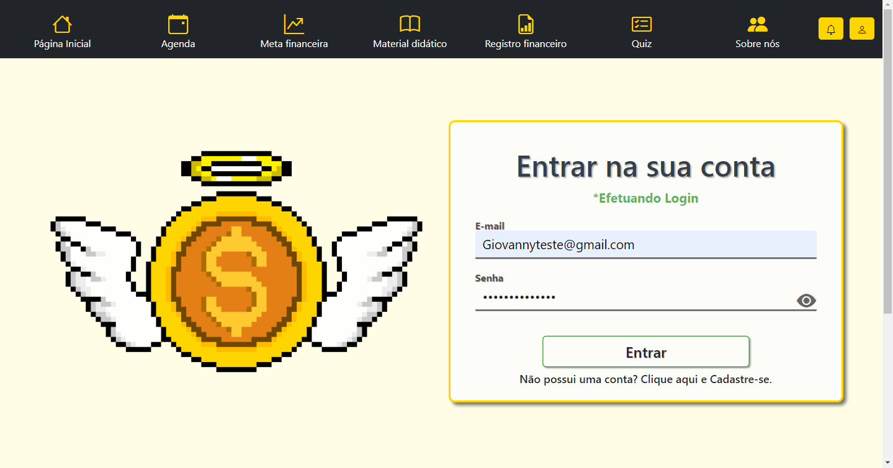
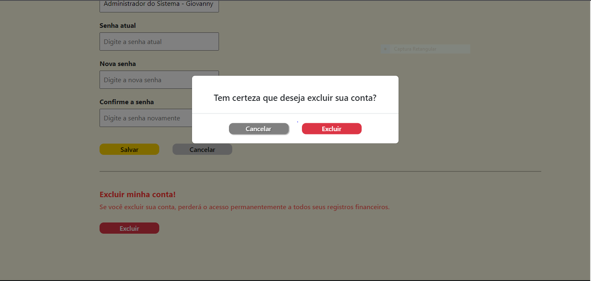
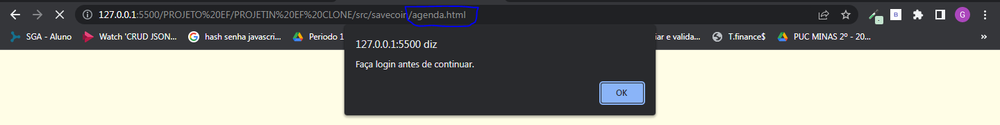
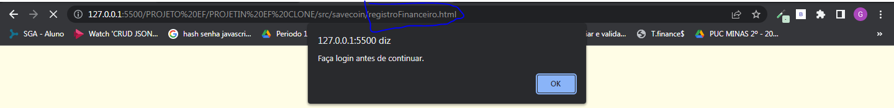

# Programação de Funcionalidades

Nesta seção estão descritos os artefatos e estruturas de dados criados para atender aos requisitos previstos nas <a href="docs/Etapa1Especificacao.md">Especificações do Projeto</a>, bem como as instruções para acesso e verificação da implementação. As tecnologias utilizadas se baseiam nas linguagens HTML, CSS e JavaScript.

|       ID      | Descrição do Requisito  | Prioridade | Responsável |
|------|-----------------------------------------|----| ----|
|RF-001|A aplicação apresentará uma HOME PAGE para acesso a determinadas seções sem necessidade de login|ALTA|AMANDA
|RF-002|A aplicação apresentará graficamente os dados relativos às receitas e despesas dos últimos 12 na funcionalidade REGISTRO FINANCEIRO|MÉDIA|AMANDA|
|RF-003|A aplicação permitirá que o usuário realize a gestão dos valores de receitas mensais na funcionalidade REGISTRO FINANCEIRO|ALTA|DIOVANA|
|RF-004|A aplicação permitirá que o usuário realize a gestão dos valores de despesas mensais na funcionalidade REGISTRO FINANCEIRO|ALTA|DIOVANA|
|RF-005|A aplicação permitirá que o usuário realize a gestão de datas para lembretes financeiros na funcionalidade AGENDA|ALTA|GIANLUCA|
|RF-006|A aplicação permitirá que o usuário realize a gestão do seu perfil cadastrado na aplicação|MÉDIA|GIOVANNY|
|RF-007|A aplicação apresentará o balanço financeiro mensal referente às receitas e despesas na funcionalidade REGISTRO FINANCEIRO|ALTA|GIOVANNY|
|RF-008|A aplicação permitirá que o usuário realize a gestão de suas metas na funcionalidade META FINANCEIRA|ALTA|PEDRO|
|RF-009|A aplicação contará com uma LÓGICA DE ACESSO para controle de login de usuários e autorização de acesso às páginas|ALTA|GIOVANNY|
|RF-010|A aplicação apresentará uma seção com matérias destinadas à educação financeira na funcionalidade MATERIAL DE DIDÁTICO|ALTO|ROMÁRIO|
|RF-011|A aplicação permitirá que o usuário realize a avaliação de seus conhecimentos sobre educação financeira na funcionalidade QUIZ|ALTO|ROMÁRIO|

## Agenda

## Requisito

### RF-005: A aplicação permitirá que o usuário realize a gestão de datas para lembretes financeiros na funcionalidade AGENDA

Para atender aos requisitos RF-005 foi desenvolvida a página Agenda, `agenda.html`.

Ao acessar a página Agenda, será exibido um calendário para o usuário visualizar e adicionar novos lembretes. Após adicionar o lembrete desejado, será possível visualizar o evento no calendário. Com o auxílio das ferramentas da Agenda, será possível fazer a edição, visualização, adição, remoção e exportação de eventos. 

Ao clicar no ícone "+" o usuário será capaz de adicionar um lembrete e salvar no calendário.

Com o evento criado, será possível a visualização do lembrete no calendário.

Clicando duas vezes no nome do evento desejado para edição, abrirá uma janela onde será possível editar as informações do mesmo.

Na janela do lembrete será possível remover o evento ao clicar no botão "Remover".

No ícone de "seta", localizado no menu superior do calendário, será possível exportar seus eventos para o formato desejado.

## Sistema de Login 

## Requisito

### RF-006 - A aplicação permitirá que o usuário realize a gestão do seu perfil cadastrado na aplicação

### Criar Conta

Caso o usuario não possua uma conta já cadastrada no sistema, o mesmo pode criar e `ADICIONAR` uma clicando em "Não possui uma conta? Clique aqui e Cadastre-se", após isto preencher corretamente os campos de novo usuario (Usuario, nome completo, e-mail, senha, confirmação de senha)  e clicando no botão "salvar" os dados do usuario serão `ADICIONADOS` ao sistema com um ID único, possibilitando ao usuario efetuar login posteriormente sem a necessidade de criar outra conta. 

### Editar Conta

Para `EDITAR` informações da conta é necessario estar logado e após isso clicar na barra de navegação em "Editar Perfil". Após acessar a pagina 'Perfil do Usuario' o mesmo pode alterar as informações como o nome e inserir uma nova senha (após uma validação com a senha atual), e basta clicar no botão "Salvar" que as alterações serão realizadas.

### Excluir Conta

Para `EXCLUIR` a conta, o usuario deve estar logado, e dentro da página 'Perfil do Usuario' o mesmo deve clicar no botão "excluir" destacado em vermelho. Após isso clicar novamente no botão "excluir" que irá aparecer dentro de uma janela para confirmar a vontade do usuario.

## Meta Financeira

## Requisitos

### RF-008: A aplicação permitirá que o usuário realize a gestão de suas metas na funcionalidade Meta Financeira

Para atender aos requisitos RF-008 foi desenvolvida a página Meta Financeira, `metaFinanceira.html`.

Ao acessar a página Meta Financeira, será exibido um botão para o usuário adicionar novas metas e serão carregadas as metas já cadastradas pelo usuário, caso ele já tenha alguma cadastrada. Havendo metas cadastradas, o usuário tem como possibilidade, através de botões, a exclusão da meta, adicionar uma nova entrada financeira/depósito e editar a meta.

Ao clicar no "X" vermelho para excluir a meta, um modal é aberto para confirmar se o usuário realmente quer excluí-la.

Clicando no botão "Nova Entrada", um modal com um formulário é aberto para que o usuário possa inserir a quantia de depósito na meta selecionada.

Clicando no botão "Editar", um modal com um formulário é aberto para que o usuário possa editar os dados da meta selecionada.

Clicando no botão "Adicionar nova meta", um modal com um formulário é aberto para que o usuário possa inserir os dados da nova meta.

## Lógica de Acesso do Login

## Requisito

### RF-009 - A aplicação contará com uma LÓGICA DE ACESSO para controle de login de usuários e autorização de acesso às páginas.
A aplicação permitirá que o usuário acesse páginas e recursos especificos (Agenda, Meta financeira, Registro financeiro e Perfil do Usuario) somente após efetuado o login, caso contrario o mesmo verá um alerta e será redimensionado para a página de login, para efetivar o login ou criar uma conta.

## Material Didático

## Requisito

### RF-010: A aplicação apresentará uma seção com matérias destinadas à educação financeira na funcionalidade MATERIAL DE DIDÁTICO.

Para atender ao requisito RF-010 foi desenvolvida a página MATERIAL DIDÁTICO, `hArticle.html`.

Ao acessar a página MATERIAL DIDÁTICO, serão exibidos diversos "cards" que representam os artigos disponíveis para leitura dos usuários. Cada "card" contém uma ilustração, um título, um texto resumo e um botão.

Clicando no botão 'Aprenda', o usuário será direcionado à página, `articleXX.html` que contém o artigo na íntegra para leitura e aprendizado.

## Quiz

## Requisito

### RF-011: A aplicação permitirá que o usuário realize a avaliação de seus conhecimentos sobre educação financeira na funcionalidade QUIZ.

Para atender ao requisito RF-011 foi desenvolvida a página QUIZ, `quiz.html`.

Ao acessar a página QUIZ, será exibido um jogo interativo de perguntas e respostas sobre conhecimentos em educação financeira baseado nos artigos disponíveis na aba MATERIAL DIDÁTICO. O quiz é composto de seis perguntas, contendo três opções de resposta e apenas uma correta. O quiz conta com um marcador de pontos, uma barra de progresso, destaque visual para opção de resposta a ser selecionada, resposta visual nas cores verde ou vermelho conforme acerto ou erro da questão, notificação sonora conforme acerto ou erro da questão e uma notificação sonora de vitória para pontuações altas.

Ao passar o mouse sobre uma alternativa, esta receberá um destaque visual.

Ao escolher uma alternativa, será acionado um destaque visual, verde para acerto, e uma notificação sonora.

Ao escolher uma alternativa, será acionado um destaque visual, vermelho para erro, e uma notificação sonora.

Em seguida será exibida uma nova pergunta.

Os processos anteriores são repetidos, até o final das perguntas.
Ao fim do quiz, será exibida uma tela com a informação "Fim de Jogo!", a pontuação final do jogador, e uma notificação sonora de aplausos para pontuações altas.

